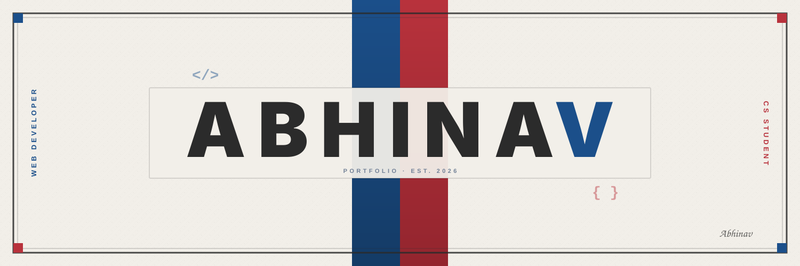

  <!-- Vintage Sports Poster Banner (1500x500) -->
  

    

  <h2>DEVELOPER · EXPLORER · CREATIVE THINKER</h2>

 

## ▍ ABOUT ME

I am **Abhinav**, a Computer Science Engineering student and web developer looking for internships and entry-level engineering roles. I specialize in backend development, full stack development, and distributed architectures while crafting intuitive, responsive web interfaces.

Driven by curiosity and craftsmanship, I focus on real time problems,clean maintainable code, real-time mechanics, and practical systems that solve tangible problems.

 

| Quick Fact | Details |
| :--- | :--- |
| 🎯 **Core Focus** | Full-Stack Web Engineering, Backend Services & System Architecture |
| ⚡ **Currently Exploring** | Ai engineering,Designing, Cloud Infrastructure & Distributed State |
| 💼 **Seeking** | Software Engineer Internships & Entry-Level Roles (Available Immediately) |

 

 

## ▍ TECH STACK

### Languages

)

### Frontend

### Backend

### Databases

### Tools & Intelligent Systems

 

 

## ▍ FEATURED PROJECTS

<table width="100%">
  <tr>
    <td width="50%" valign="top">
      <h3>⚾ CricAuctionIPL</h3>
      
Real-time IPL auction simulator featuring multiplayer gameplay, dynamic team budget management, and live bidding logic.

      

        
        
        
        
      

      

        
        &nbsp;
        
      

    </td>
    <td width="50%" valign="top">
      <h3>🏠 CoLiviMates</h3>
      
Co-living and roommate discovery platform built for finding compatible roommates and shared urban accommodations in budget.

      

        
        
        
        
      

      

        
        &nbsp;
        
      

    </td>
  </tr>
  <tr>
    <td width="50%" valign="top">
      <h3>🛡️ AegisAI</h3>
      
AI-powered security triage platform combining deterministic threat detection with a 4-agent LLM reasoning pipeline.

      

        
        
        
        
      

      

        
        &nbsp;
        
      

    </td>
    <td width="50%" valign="top">
      <h3>✨ Talvyn</h3>

AI-powered career companion that helps you discover, analyze, save, and organize job opportunities directly from the web.

  
  
  
  

  
  &nbsp;
  

    </td>
  </tr>
</table>

  

 

## ▍ GITHUB ACTIVITY & METRICS

  

<table width="100%" align="center">
  <tr>
    <td width="50%" align="center" valign="middle">
      
    </td>
    <td width="50%" align="center" valign="middle">
      
    </td>
  </tr>
</table>

 

  

## ▍ CONNECT WITH ME

  
<b>Interested in collaborating or discussing full-time & internship opportunities? Let's connect!</b>

  
  

    
    &nbsp;
    
    &nbsp;
    
    &nbsp;
    
  

 

  
Thank you guys!!!

  

