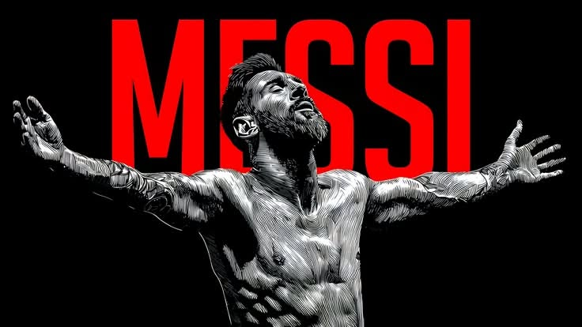

  

# Abhinav

Developer · Backend Explorer · Builder

Building real-world applications, backend systems, and modern web experiences.

---

### ✧ Stack

**Languages**  

)

**Frontend**  

**Backend**  

**Database**  

**Tools**  

---

### ✧ Projects

| Project | Description | Links |
| :--- | :--- | :--- |
| **CricAuctionIPL** | Real-time IPL auction simulator with multiplayer gameplay, team management, bidding logic, and auction mechanics. |   |
| **CoLiveMates** | A co-living and roommate discovery platform for finding suitable shared living spaces. |   |
| **AegisAI** | AI-assisted security operations platform combining deterministic threat detection with a 4-agent LLM reasoning pipeline for incident triage. |  |
| **MusicSuggestor** | Music discovery and recommendation application with mood dashboards and full-stack Spring Boot architecture backed by PostgreSQL. |  |
| **Portfolio** | Personal software engineering portfolio showcasing interactive 3D elements, GSAP animations, and projects. |   |

---

### ✧ Contact

&nbsp;

&nbsp;

&nbsp;

---

  Thanks for stopping by.

