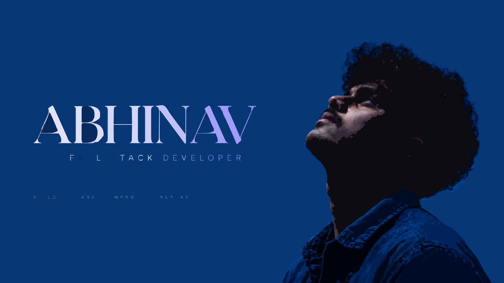

  

 

# Abhinav

**Developer · Backend Explorer · Builder**

Building real-world applications, backend systems, and modern web experiences.

---

### ✦ &nbsp; Tech Stack

**Languages**  

)

 

**Frontend**  

 

**Backend**  

 

**Database & Backend Services**  

 

**Mobile**  

 

**Tools & DevOps**  

 

**Engineering**  

 

**AI / Intelligent Systems**  

---

### ✦ &nbsp; Projects

<table width="100%">
  <tr>
    <td width="50%" valign="top">
      <b>CricAuctionIPL</b>
        
      
      &nbsp;
      
    </td>
    <td width="50%" valign="top">
      <b>CoLiveMates</b>
        
      
      &nbsp;
      
    </td>
  </tr>
  <tr>
    <td width="50%" valign="top">
      <b>AegisAI</b>
        
      
    </td>
    <td width="50%" valign="top">
      <b>Portfolio</b>
        
      
      &nbsp;
      
    </td>
  </tr>
</table>

---

### ✦ &nbsp; Contact

---

  ✦ &nbsp; Thanks for stopping by &nbsp; ✦

